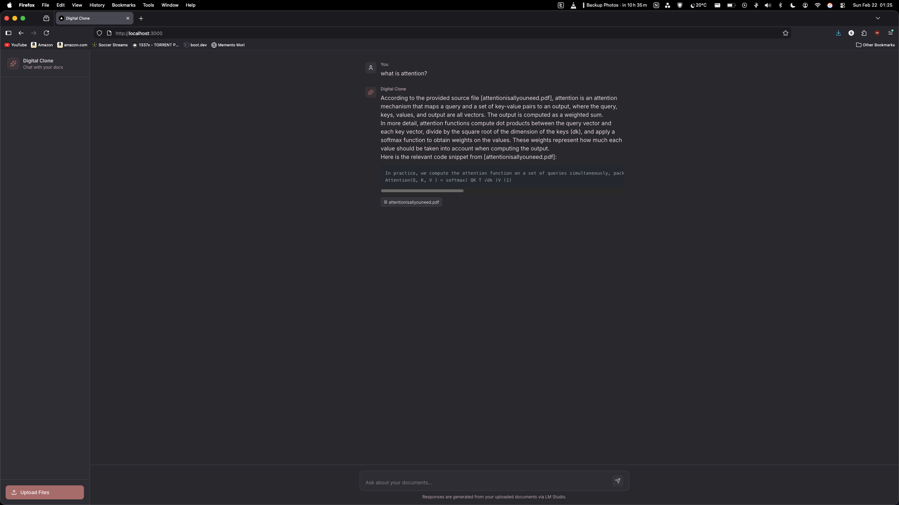
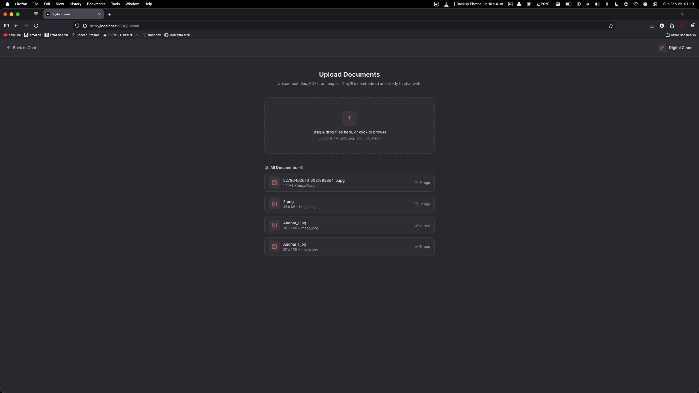

# Digital Clone — Web UI

A sleek, dark-mode chat interface for talking to your own documents. Upload PDFs, text files, or images and ask questions about them — answers are generated in real time via a local LLM (powered by LM Studio) with Retrieval-Augmented Generation (RAG).

This is the **frontend only**. It expects a separate backend API to handle file ingestion, vector storage, and LLM inference.

---

## Screenshots

### Chat Interface


### Upload Documents


---

## Features

- 💬 **Streaming chat** — responses stream token-by-token from the backend API using Server-Sent Events
- 📄 **Document Q&A** — answers are grounded in your uploaded documents, with source citations shown inline
- 📁 **File upload** — drag-and-drop or click-to-browse uploader supporting `.txt`, `.pdf`, `.jpg`, `.png`, `.gif`, `.webp`
- 🗂 **Document library** — see all previously uploaded files with size, type, and upload time
- ✨ **Markdown rendering** — assistant responses render full markdown including syntax-highlighted code blocks
- 🎨 **Custom dark theme** — warm, muted color palette with smooth transitions and hover effects

---

## Tech Stack

| Layer | Technology |
|---|---|
| Framework | [Next.js 16](https://nextjs.org/) (App Router) |
| Language | TypeScript |
| Styling | Tailwind CSS v4 + CSS custom properties |
| Markdown | `react-markdown` + `react-syntax-highlighter` |
| Icons | `lucide-react` |

---

## Getting Started

### Prerequisites

- Node.js 18+
- A running instance of the [Digital Clone backend](https://github.com/rohansatram/digital-clone) (FastAPI + LM Studio)

### Install & Run

```bash
# Install dependencies
npm install

# Start the development server
npm run dev
```

Open [http://localhost:3000](http://localhost:3000) in your browser.

### Environment Variables

By default the app points to `http://localhost:8000` for the backend. To override this, create a `.env.local` file:

```env
NEXT_PUBLIC_API_URL=http://localhost:8000
```

---

## Project Structure

```
app/
├── page.tsx          # Chat interface (/)
├── upload/
│   └── page.tsx      # Document upload page (/upload)
├── globals.css       # Global styles & design tokens
└── layout.tsx        # Root layout
docs/
└── screenshots/      # UI screenshots used in this README
```

---

## Backend API Contract

This frontend expects the following endpoints on the backend:

| Method | Path | Description |
|---|---|---|
| `POST` | `/chat` | Send a message; returns an SSE stream of `token` and `sources` events |
| `POST` | `/upload` | Upload a file (multipart); returns `filename`, `content_type`, `size_bytes`, `chunks_embedded` |
| `GET` | `/files` | Returns `{ files: StoredFile[] }` — list of all previously uploaded documents |

### SSE Event Format (`/chat`)

```json
data: {"type": "sources", "sources": ["attentionisallyouneed.pdf"]}
data: {"type": "token", "content": "According to the paper..."}
```

---

## License

MIT
